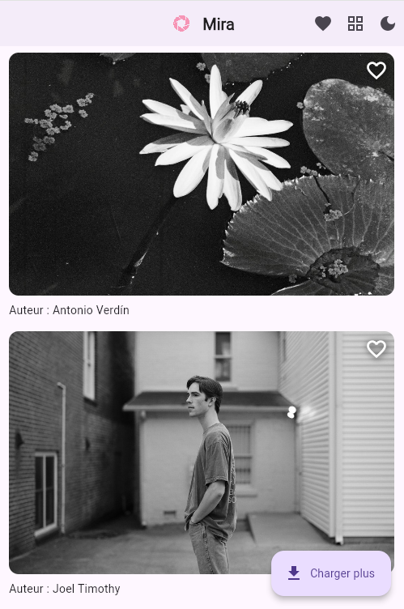
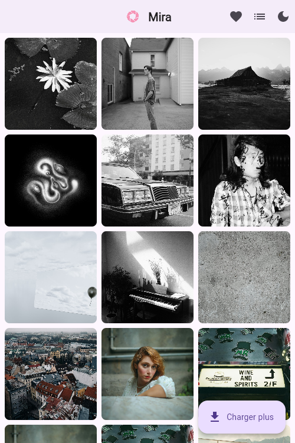
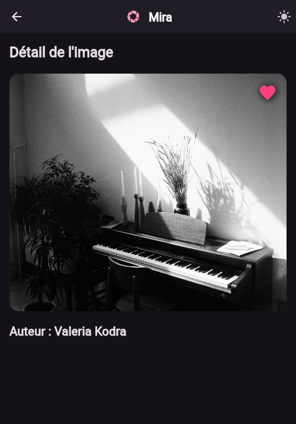

# Mira 📷✨ | EN

**Mira** is a Flutter image-exploration app inspired by Instagram.  
Browse a live gallery, like photos, switch between light / dark themes, and toggle list- or grid-style layouts.  
The project was built as a clean, responsive showcase with a strong focus on user experience.

## 🔥 Key features

- 🔍 Displays photos from the Unsplash API
- ❤️ Like / unlike system (state handled with Provider)
- 🌗 Light mode & Dark mode (via a Theme Switcher)
- 🖼️ List-oriented feed **or** 3-column grid view—switchable on the fly
- 🔁 Infinite scroll with a “Load more” button
- 🧭 Smooth navigation using GoRouter (deep-link ready)
- 🔍 Detail screen for every photo
- 🧱 Clean architecture (services, providers, reusable widgets)

## 🧪 Tech & main packages

| Tech / Package | Purpose |
|----------------|---------|
| **Flutter 3+** | Cross-platform framework |
| `provider` | Global / local state management |
| `go_router` | Declarative routing & deep links |
| `cached_network_image` | Fast image loading & caching |
| `dio` + `http` | REST calls to Unsplash API |

## 📸 Screenshots

| MasterView – List | MasterView – Grid | Dark Mode |
|-------------------|-------------------|-----------|
|  |  |  |


## 🚀 Getting started

```bash
flutter pub get
flutter run
```

🤝 About the project
Mira was built solo in under 48 hours during an accelerated learning sprint—aiming for clean code, modern UI, and a smooth mobile experience.

👤 Developed by @RayanKuhn
📫 Professional contact available on my GitHub profile


# Mira 📷✨|FR

**Mira** est une application Flutter d’exploration d’images inspirée d’Instagram. Elle permet de parcourir une galerie dynamique, de liker des photos, de changer de thème (dark/light) et de basculer entre un affichage en liste ou en grille. Ce projet a été conçu comme une vitrine personnelle, propre et responsive, avec une attention particulière portée à l’expérience utilisateur.

## 🔥 Fonctions principales

- 🔍 Affichage d’images depuis l’API Unsplash
- ❤️ Système de like avec persistance en mémoire (Provider)
- 🌙 Light mode / Dark mode (avec ThemeSwitcher)
- 📱 Affichage en liste ou en grille à la Instagram
- 🔁 Scroll infini avec bouton "Charger plus"
- 🧭 Navigation fluide (GoRouter)
- 🖼️ Page de détails pour chaque image
- ⚙️ Architecture propre avec séparation logique (services, providers, widgets)

## 🧪 Techs & packages utilisés

- Flutter 3+
- `provider` pour la gestion d’état
- `go_router` pour la navigation
- `cached_network_image` pour un chargement performant
- `http` pour les appels API Unsplash

## 📸 Aperçus

| MasterView (Liste) | MasterView (Grille) | Mode sombre |
|-------------------|---------------------|-------------|
|  |  |  |

## 🚀 Lancer le projet

```bash
flutter pub get
flutter run
```

## 🤝 A propos

Ce projet a été réalisé en solo en moins de 48h dans un cadre pédagogique accéléré, avec une logique de qualité de code et une volonté de proposer un rendu visuellement moderne.

👤 Développé par @RayanKuhn
📫 Contact pro disponible sur mon profil GitHub


